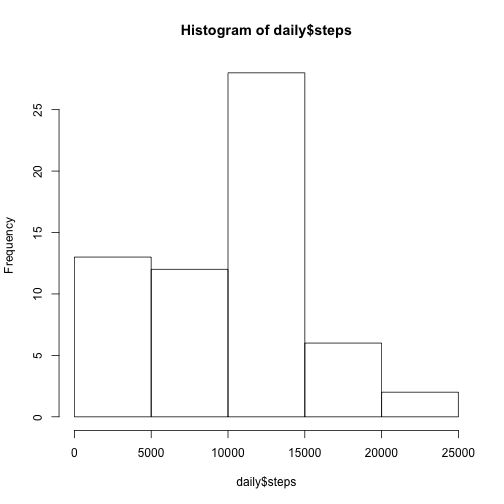
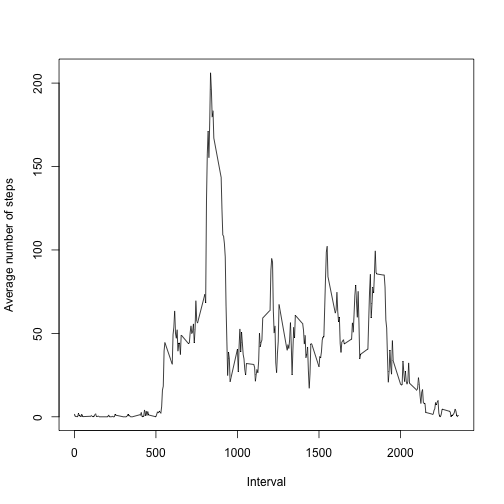
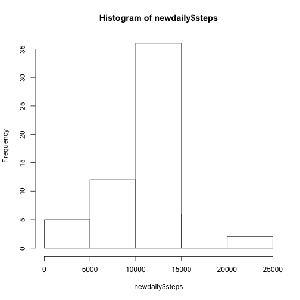
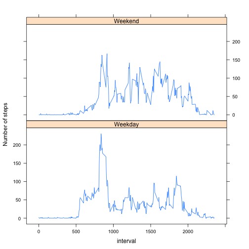

## Loading and preprocessing the data
Reading in the data--requires the file in the working directory


```r
data <- read.csv("activity.csv")
```

Histogram of total steps per day


```r
library(dplyr)
daily <- aggregate(data$steps, by = list(data$date), sum, na.rm=TRUE)
colnames(daily) <- c("date", "steps")
hist(daily$steps)
```

 

## What is mean total number of steps taken per day?

Mean and median number of steps per day


```r
mean(daily$steps, na.rm=TRUE)
```

```
## [1] 9354.23
```

```r
median(daily$steps, na.rm=TRUE)
```

```
## [1] 10395
```

## What is the average daily activity pattern?


```r
meaninterval <- aggregate(data$steps, by = list(data$interval), mean, na.rm = TRUE) 
colnames(meaninterval) <- c("interval", "mean_steps")
plot(meaninterval$interval, meaninterval$mean_steps, xlab="Interval", ylab="Average number of steps", type="n")
lines(meaninterval$interval, meaninterval$mean_steps, type="l")
```

 


Maximum number of steps on average was 206, in interval 835


```r
index <- which.max(meaninterval$mean_steps)
meaninterval[index, 1]
```

```
## [1] 835
```


## Imputing missing values

How many missing values?


```r
sum(is.na(data$steps))
```

```
## [1] 2304
```


Replacing them with the rounded mean value by interval in a new data frame and then reporting the new mean and median

The new median has dropped slightly while the mean is the same


```r
newdata <- data
newdata <- merge(newdata, meaninterval, by="interval", sort=FALSE)
newdata$steps[is.na(newdata$steps)] <- newdata$mean_steps[is.na(newdata$steps)]
newdata$steps <- round(newdata$steps)
```

Plotting new histogram--note higher frequencies from NA replacement


```r
newdaily <- aggregate(newdata$steps, by = list(newdata$date), sum, na.rm=TRUE)
colnames(newdaily) <- c("date", "steps")
hist(newdaily$steps)
```

 

## Are there differences in activity patterns between weekdays and weekends?


```r
library(lubridate)
newdata$date <- ymd(newdata$date)
newdata$weekday <- wday(newdata$date, label=TRUE)
newdata$weekday <- ifelse((newdata$weekday=="Sun"|newdata$weekday=="Sat"), "Weekend", "Weekday")
newmeaninterval <- group_by(newdata, interval, weekday)
weekdays <- summarize(newmeaninterval, mean=mean(steps))
library(lattice)                     
xyplot(mean ~ interval | weekday, data=weekdays, type="l", ylab="Number of steps", layout=c(1,2))
```

 
